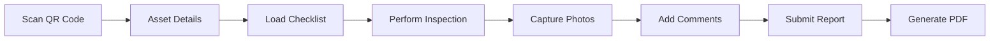

# ?? ShopInspector - Equipment Inspection Management System

[](https://dotnet.microsoft.com/download/dotnet/9.0)
[](https://docs.microsoft.com/en-us/ef/)
[](https://getbootstrap.com/)
[](https://opensource.org/licenses/MIT)

A modern, mobile-first equipment inspection web application designed for manufacturing and industrial environments. Features QR code integration, real-time inspections, comprehensive reporting, and robust administrative controls.

## ?? Live Demo
[View Demo](https://dotnetinspectionhub-3.onrender.com/Admin/Asset) | [Screenshots](#screenshots)

## ? Key Features

### ?? **Smart Inspections**
- **QR Code Integration** - Instant asset access via mobile scanning
- **Mobile-First Design** - Optimized for tablets and smartphones
- **Photo Capture** - Real-time image capture with compression
- **Dynamic Checklists** - Asset-specific inspection workflows
- **Offline Support** - Continue inspections without connectivity

### ?? **Powerful Management**
- **Admin Dashboard** - Comprehensive system overview
- **Asset Management** - Complete lifecycle tracking
- **PDF Reports** - Professional inspection documentation
- **Audit Trails** - Complete inspection history
- **Role-Based Access** - Secure multi-user environment

### ?? **Business Value**
- ? **Faster Inspections** - Reduce inspection time by 60%
- ?? **Mobile Accessibility** - Inspect anywhere, anytime
- ?? **Compliance Ready** - Meet regulatory requirements
- ?? **Data Security** - Enterprise-grade protection
- ?? **Analytics** - Data-driven insights

## ??? Architecture

Built with **Clean Architecture** principles:

```
???????????????????    ???????????????????    ???????????????????
?   Presentation  ?    ?   Application   ?    ?  Infrastructure ?
?                 ?    ?                 ?    ?                 ?
? • Razor Pages   ?????? • Services      ?????? • Repositories  ?
? • Controllers   ?    ? • Interfaces    ?    ? • Entity Framework?
? • Views         ?    ? • DTOs          ?    ? • External APIs ?
???????????????????    ???????????????????    ???????????????????
                                ?
                                ?
                       ???????????????????
                       ?      Core       ?
                       ?                 ?
                       ? • Entities      ?
                       ? • Enums         ?
                       ? • Exceptions    ?
                       ???????????????????
```

## ??? Technology Stack

| Category | Technology | Purpose |
|----------|------------|---------|
| **Framework** | .NET 9 | Modern web application development |
| **Web** | ASP.NET Core MVC + Razor Pages | Hybrid approach for optimal UX |
| **Database** | SQL Server + Entity Framework Core | Robust data persistence |
| **UI** | Bootstrap 5 + Custom CSS | Responsive, mobile-first design |
| **PDF** | QuestPDF | Professional report generation |
| **Logging** | Serilog | Structured application logging |
| **Authentication** | Cookie-based Auth | Secure session management |
| **QR Codes** | QRCoder | Asset identification system |

## ?? Screenshots

<details>
<summary>??? View Screenshots</summary>

### Mobile Inspection Flow


### Admin Dashboard


### QR Code Generation


### PDF Report


</details>

## ?? Quick Start

### Prerequisites
- ? [.NET 9 SDK](https://dotnet.microsoft.com/download/dotnet/9.0)
- ? [SQL Server](https://www.microsoft.com/en-us/sql-server/sql-server-downloads) (LocalDB, Express, or Full)
- ? [Git](https://git-scm.com/)
- ? Modern web browser

### Installation

```bash
# Clone the repository
git clone https://github.com/yourusername/ShopInspector.git
cd ShopInspector

# Restore dependencies
dotnet restore

# Update database connection string
# Edit: ShopInspector.Web/appsettings.json
{
  "ConnectionStrings": {
    "DefaultConnection": "Server=(localdb)\\mssqllocaldb;Database=ShopInspectorDB;Trusted_Connection=true;MultipleActiveResultSets=true"
  }
}

# Create and seed database
cd ShopInspector.Web
dotnet ef database update

# Run the application
dotnet run

# Navigate to
# https://localhost:5001 (HTTPS)
# http://localhost:5000 (HTTP)
```

### ?? Default Credentials
```
Username: admin
Password: password
```
> ?? **Security Warning**: Change these credentials before production deployment!

## ?? Core Modules

### ?? Asset Management
- **Asset Types** - Categorize equipment (Hydraulic Press, CNC Machine, etc.)
- **Asset Registry** - Complete equipment database
- **Location Tracking** - Department and physical location management
- **QR Code Generation** - Unique identifiers for each asset

### ? Inspection System
- **Checklist Management** - Configurable inspection criteria
- **Asset-Checklist Mapping** - Link specific checklists to assets
- **Mobile Inspections** - Touch-friendly inspection interface
- **Photo Documentation** - Capture and store inspection evidence

### ?? User Management
- **Employee Database** - Inspector and technician management
- **Company Management** - Multi-tenant organization support
- **Role-Based Access** - Secure permission system

### ?? Reporting & Analytics
- **PDF Export** - Professional inspection reports
- **Inspection History** - Complete audit trails
- **Dashboard Views** - Real-time system overview

## ?? Inspection Workflow



1. **?? Scan QR Code** - Mobile device scans asset QR code
2. **?? Asset Loading** - System displays asset details and history
3. **? Checklist Display** - Shows relevant inspection checklist
4. **?? Inspection** - User completes checklist items
5. **?? Photo Capture** - Document findings with images
6. **?? Comments** - Add detailed observations
7. **?? Report Generation** - Automatic PDF creation
8. **?? Storage** - Secure data persistence

## ?? API Endpoints

### Public Routes (No Authentication)
```http
GET    /PublicInspection/Assets          # Browse available assets
GET    /PublicInspection/Start/{id}      # Start asset inspection
POST   /PublicInspection/Submit          # Submit inspection data
GET    /PublicInspection/History/{id}    # View inspection history
GET    /PublicInspection/Details/{id}    # Detailed inspection view
```

### Admin Routes (Authentication Required)
```http
GET    /Admin/Dashboard                  # System overview
GET    /Admin/Asset                      # Asset management
POST   /Admin/Asset/Create               # Create new asset
GET    /Admin/Asset/GenerateQr/{id}      # Generate QR code
GET    /Admin/Inspection/Export/{id}     # Export PDF report
```

## ?? Configuration

### Database Settings
```json
{
  "ConnectionStrings": {
    "DefaultConnection": "Your SQL Server connection string"
  }
}
```

### Logging Configuration
```json
{
  "Serilog": {
    "MinimumLevel": {
      "Default": "Information",
      "Override": {
        "Microsoft": "Warning",
        "System": "Warning"
      }
    },
    "WriteTo": [
      { "Name": "Console" },
      {
        "Name": "File",
        "Args": {
          "path": "logs/app-.log",
          "rollingInterval": "Day"
        }
      }
    ]
  }
}
```

### File Upload Settings
```json
{
  "FileUpload": {
    "MaxSizeMB": 50,
    "AllowedExtensions": [".jpg", ".jpeg", ".png", ".gif"],
    "UploadPath": "wwwroot/uploads"
  }
}
```

## ?? Security Features

- **??? Authentication** - Cookie-based secure sessions
- **?? Authorization** - Role-based access control
- **?? CSRF Protection** - Anti-forgery token validation
- **?? File Validation** - Secure upload with type checking
- **?? Input Sanitization** - XSS and injection prevention
- **?? Audit Logging** - Complete action tracking

## ?? Testing

```bash
# Run unit tests
dotnet test ShopInspector.Tests

# Run integration tests
dotnet test ShopInspector.IntegrationTests

# Generate coverage report
dotnet test --collect:"XPlat Code Coverage"
```

## ?? Deployment

### Docker Deployment
```dockerfile
FROM mcr.microsoft.com/dotnet/aspnet:9.0 AS runtime
WORKDIR /app
COPY publish/ ./
EXPOSE 8080
ENTRYPOINT ["dotnet", "ShopInspector.Web.dll"]
```

### Azure App Service
1. Publish to folder: `dotnet publish -c Release`
2. Deploy to Azure App Service
3. Configure connection strings
4. Enable Application Insights (optional)

### IIS Deployment
1. Install .NET 9 Runtime
2. Configure IIS application pool
3. Deploy published files
4. Set up SQL Server connection

## ?? Contributing

We welcome contributions! Please see our [Contributing Guide](CONTRIBUTING.md) for details.

### Development Setup
```bash
# Fork and clone
git clone https://github.com/yourusername/ShopInspector.git
cd ShopInspector

# Create feature branch
git checkout -b feature/amazing-feature

# Make changes and commit
git commit -m "Add amazing feature"

# Push and create pull request
git push origin feature/amazing-feature
```

### Code Standards
- Follow [C# Coding Conventions](https://docs.microsoft.com/en-us/dotnet/csharp/fundamentals/coding-style/coding-conventions)
- Use meaningful variable and method names
- Add XML documentation for public APIs
- Include unit tests for new features

## ?? Troubleshooting

### Common Issues

| Issue | Solution |
|-------|----------|
| Database connection fails | Verify connection string in appsettings.json |
| QR codes not generating | Check file permissions in wwwroot/uploads |
| PDF export fails | Ensure QuestPDF license is valid |
| Mobile upload issues | Check file size limits and MIME types |

### Debug Mode
```bash
# Enable detailed logging
export ASPNETCORE_ENVIRONMENT=Development
dotnet run --verbosity detailed
```

## ?? Performance

- **? Fast Loading** - Optimized Entity Framework queries
- **?? Mobile Optimized** - Compressed images and minimal payload
- **?? Caching** - Smart data caching strategies
- **?? Monitoring** - Built-in performance metrics

## ??? Roadmap

- [ ] **Mobile App** - Native iOS/Android applications
- [ ] **Real-time Sync** - SignalR integration
- [ ] **Advanced Analytics** - Predictive maintenance insights
- [ ] **API Integration** - REST API for third-party systems
- [ ] **Multi-language** - Internationalization support
- [ ] **Cloud Storage** - Azure Blob/AWS S3 integration

## ?? License

This project is licensed under the MIT License - see the [LICENSE](LICENSE) file for details.

## ?? Support

- ?? **Email**: support@shopinspector.com
- ?? **Discord**: [Join our community](https://discord.gg/shopinspector)
- ?? **Documentation**: [Full Documentation](https://docs.shopinspector.com)
- ?? **Issues**: [GitHub Issues](https://github.com/yourusername/ShopInspector/issues)

## ?? Acknowledgments

- [QuestPDF](https://www.questpdf.com/) - Excellent PDF generation library
- [Bootstrap](https://getbootstrap.com/) - Responsive UI framework
- [Entity Framework Core](https://docs.microsoft.com/en-us/ef/) - Powerful ORM
- [Serilog](https://serilog.net/) - Structured logging

---

<div align="center">

**? Star this repository if you find it helpful!**

Made with ?? for the manufacturing community

[? Back to top](#-shopinspector---equipment-inspection-management-system)

</div>